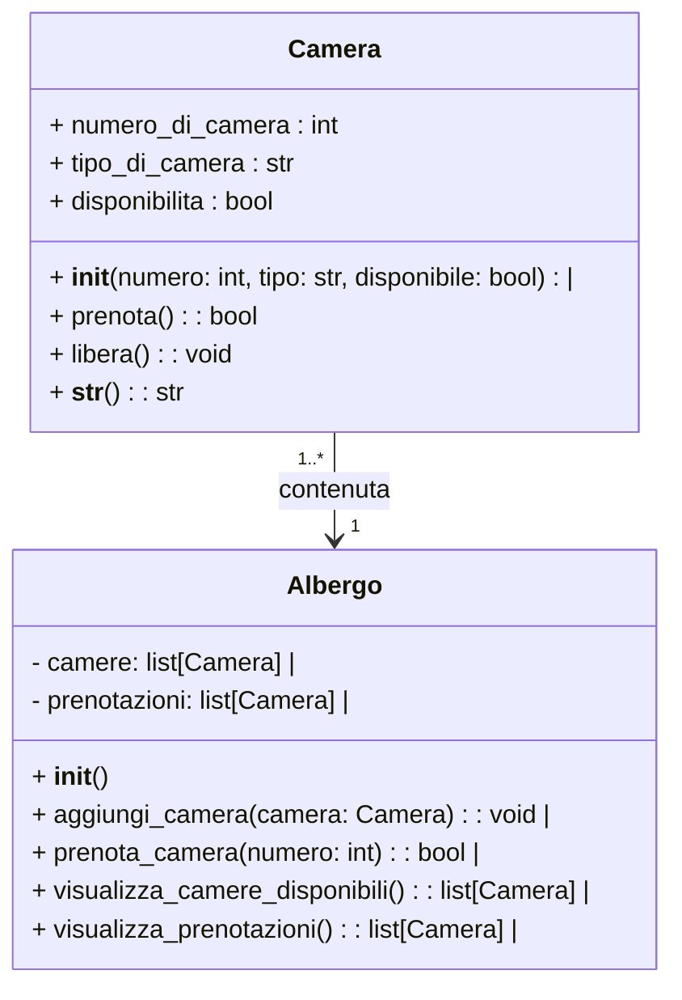

```mermaid
classDiagram
    class Albergo {
    - camere: list[Camera] |
    - prenotazioni: list[Camera] |
    + __init__()
    + aggiungi_camera(camera: Camera): void |
    + prenota_camera(numero: int): bool |
    + visualizza_camere_disponibili(): list[Camera] |
    + visualizza_prenotazioni(): list[Camera] |
    }

    class Camera {
    + numero_di_camera : int
    + tipo_di_camera : str
    + disponibilita : bool
    + __init__(numero: int, tipo: str, disponibile: bool) |
    + prenota(): bool
    + libera(): void
    + __str__(): str
    }
    
Camera "1..*" --> "1" Albergo: contenuta
```