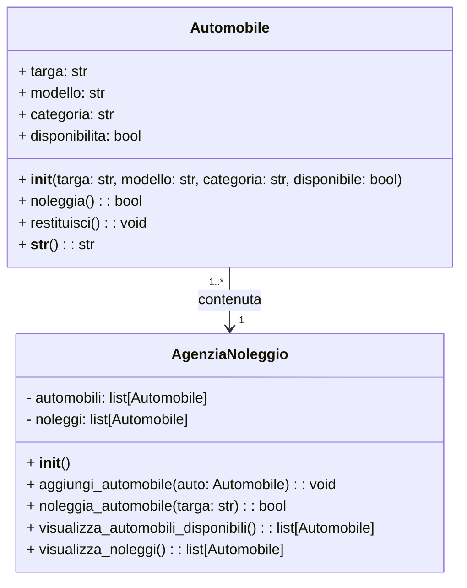

```mermaid
classDiagram
    class Automobile {
    + targa: str
    + modello: str
    + categoria: str
    + disponibilita: bool
    + __init__(targa: str, modello: str, categoria: str, disponibile: bool)
    + noleggia(): bool
    + restituisci(): void
    + __str__(): str
    }

    class AgenziaNoleggio {
    - automobili: list[Automobile]
    - noleggi: list[Automobile]
    + __init__()
    + aggiungi_automobile(auto: Automobile): void
    + noleggia_automobile(targa: str): bool
    + visualizza_automobili_disponibili(): list[Automobile]
    + visualizza_noleggi(): list[Automobile]
    }

Automobile "1..*" --> "1" AgenziaNoleggio: contenuta
```
