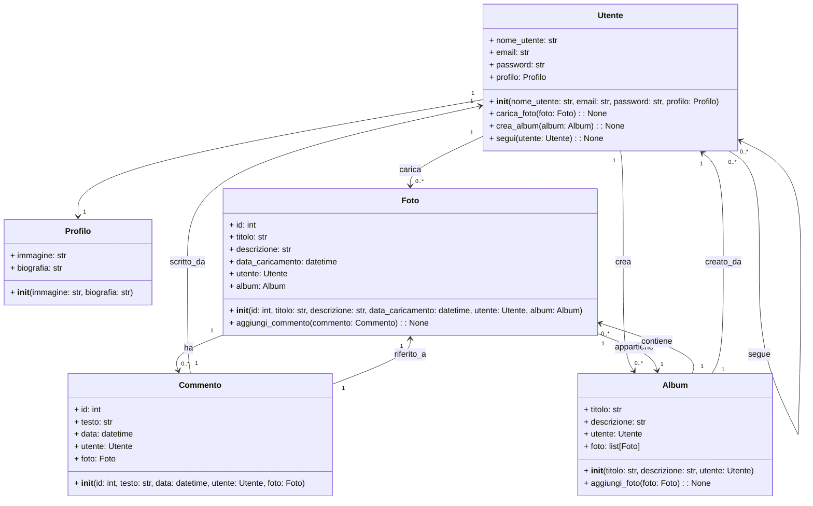

```mermaid
classDiagram
    class Utente {
    + nome_utente: str
    + email: str
    + password: str
    + profilo: Profilo
    + __init__(nome_utente: str, email: str, password: str, profilo: Profilo)
    + carica_foto(foto: Foto): None
    + crea_album(album: Album): None
    + segui(utente: Utente): None
    }

    class Profilo {
    + immagine: str
    + biografia: str
    + __init__(immagine: str, biografia: str)
    }

    class Foto {
    + id: int
    + titolo: str
    + descrizione: str
    + data_caricamento: datetime
    + utente: Utente
    + album: Album
    + __init__(id: int, titolo: str, descrizione: str, data_caricamento: datetime, utente: Utente, album: Album)
    + aggiungi_commento(commento: Commento): None
    }

    class Album {
    + titolo: str
    + descrizione: str
    + utente: Utente
    + foto: list[Foto]
    + __init__(titolo: str, descrizione: str, utente: Utente)
    + aggiungi_foto(foto: Foto): None
    }

    class Commento {
    + id: int
    + testo: str
    + data: datetime
    + utente: Utente
    + foto: Foto
    + __init__(id: int, testo: str, data: datetime, utente: Utente, foto: Foto)
    }

Utente "1" --> "1" Profilo
Utente "1" --> "0..*" Foto: carica
Utente "1" --> "0..*" Album: crea
Utente "0..*" --> "0..*" Utente: segue
Foto "1" --> "0..*" Commento: ha
Foto "1" --> "1" Album: appartiene
Album "1" --> "0..*" Foto: contiene
Album "1" --> "1" Utente: creato_da
Commento "1" --> "1" Utente: scritto_da
Commento "1" --> "1" Foto: riferito_a

```