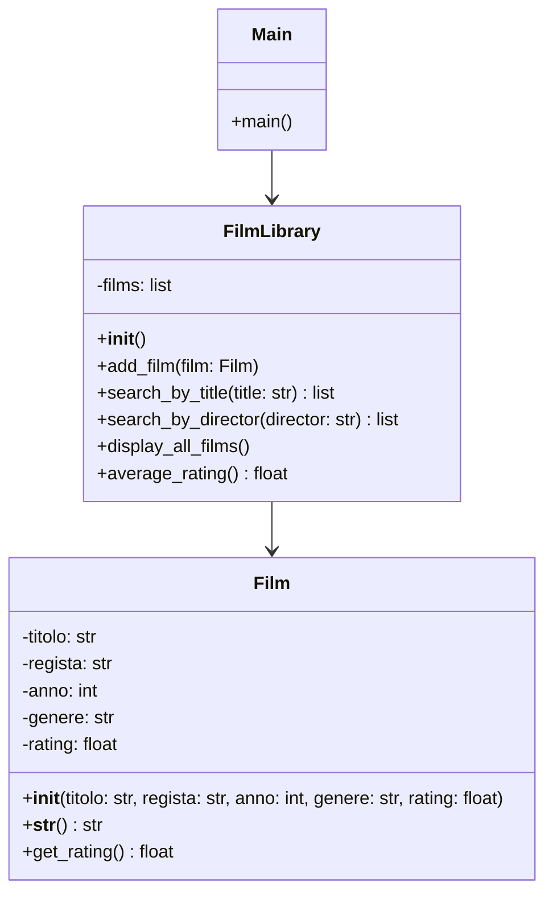

```mermaid
classDiagram
    class Film {
        -titolo: str
        -regista: str
        -anno: int
        -genere: str
        -rating: float
        +__init__(titolo: str, regista: str, anno: int, genere: str, rating: float)
        +__str__() str
        +get_rating() float
    }

    class FilmLibrary {
        -films: list
        +__init__()
        +add_film(film: Film)
        +search_by_title(title: str) list
        +search_by_director(director: str) list
        +display_all_films()
        +average_rating() float
    }

    class Main {
        +main()
    }

    FilmLibrary --> Film
    Main --> FilmLibrary
```