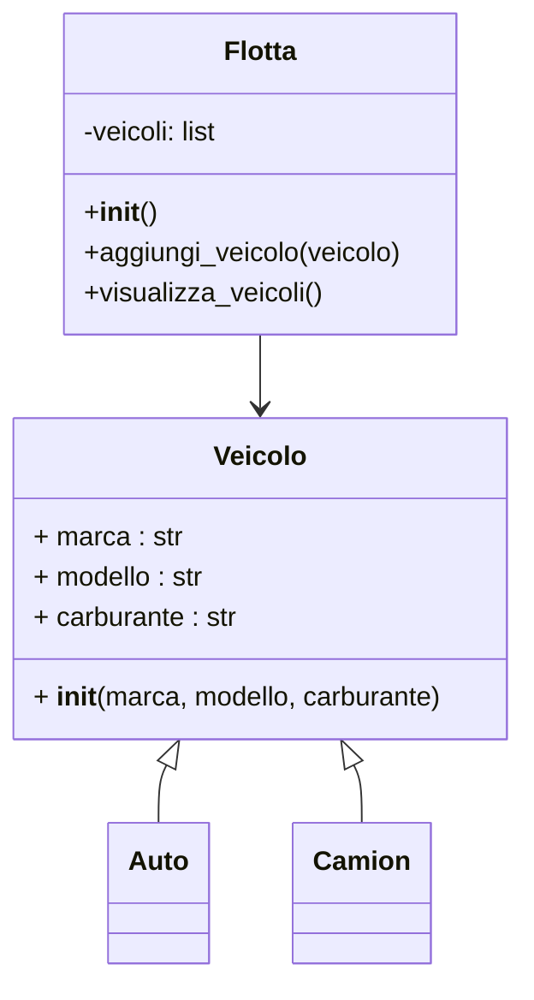

```mermaid
classDiagram
    class Flotta{
     -veicoli: list
        +__init__()
        +aggiungi_veicolo(veicolo)
        +visualizza_veicoli()
    }
    class Veicolo {
    + marca : str
    + modello : str
    + carburante : str
    + __init__(marca, modello, carburante)
    
    }

    class Auto {
    
    }
    class Camion {
    
    }

Veicolo <|-- Auto
Veicolo <|-- Camion
Flotta --> Veicolo

```